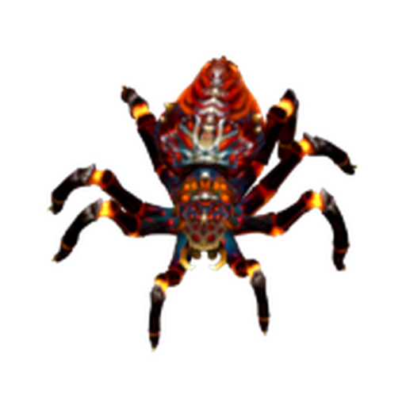

# Crimson Stalker

The Crimson Stalker is the penultimate boss of the [[Level 1|Cursed Wilds]] — a massive arachnid predator with 2400 HP. It moves at medium speed and has no elemental immunities, but its raw HP demands a fully upgraded defense.

| Stat | Value |
|---|---|
| Base HP | 2400 |
| Speed | Medium (48) |
| Armor | 25% Physical reduction |
| Resistances | None |
| Kill Reward | 100 gold |
| Appears | Wave 20 — Cursed Wilds |

---

## Traits

- Moderate armor — no elemental resistances.

---

## Strategy

The Crimson Stalker is a pure DPS milestone. 2400 HP at wave 20 means all five tower slots should be active and upgraded. There is no trick resist to plan around — this boss rewards players who have built efficiently across all 20 waves.

Frost Tower slowing is highly effective at medium speed. Poison DoT provides sustained damage throughout the crossing.

**Counters:** [[Poison Tower]] (DoT at scale), [[Frost Tower]] (slow), [[Lightning Tower]] (consistent single-target)

---

## Appears In

- [[Level 1]] — Wave 20
- Cursed Wilds campaign — Wave 20
