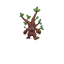

# Ent

The Ent is the first boss of the [[Level 1|Cursed Wilds]] — a massive ancient tree animated by dark magic. It is the slowest enemy encountered so far but brings HP far beyond any standard unit.

| Stat | Value |
|---|---|
| Base HP | 480 |
| Speed | Very Slow (28) |
| Armor | 32% Physical reduction |
| Resistances | Poison (immune) |
| Kill Reward | 44 gold |
| Appears | Wave 5 — Cursed Wilds |

---

## Traits

- **Armor Plated** — Physical damage reduced. Lightning deals bonus damage.
- **Poison Resist** — Immune to Poison damage.

---

## Strategy

The Ent is introduced as a pure DPS check. It will not outrun towers — the challenge is whether the player has dealt enough total damage before it exits. At wave 5 the player typically has 1–3 towers; focus fire from Arrow + Lightning is the most effective combo given both its armor and poison immunity.

**Counters:** [[Lightning Tower]], [[Frost Tower]] (slow it to extend the kill window), [[Fire Tower]]

**Avoid:** [[Poison Tower]] — fully negated by Poison Resist.

---

## Appears In

- [[Level 1]] — Wave 5 (first boss)
- Cursed Wilds campaign (cw1+) — Wave 5
