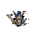

# Frozen Knight

The Frozen Knight is the second boss of the [[Level 3|Frozen Tundra]] — an armored undead warrior infused with ice magic. It is immune to both Frost and Lightning, one of the toughest double-resist bosses in the game.

| Stat | Value |
|---|---|
| Base HP | 1750 |
| Speed | Medium (48) |
| Armor | 50% Physical reduction |
| Resistances | Frost (immune), Lightning (immune) |
| Kill Reward | 64 gold |
| Appears | Wave 10 — Frozen Tundra |

---

## Traits

- **Frost Immune** — Immune to Frost damage. Fire deals 50% bonus damage.
- **Lightning Resist** — Immune to Lightning damage.
- **Armor Plated (heavy)** — 50% Physical reduction.

---

## Strategy

Frozen Knight removes two major damage sources: Frost (the Map 3 staple slow) and Lightning (the armor counter). Only Fire and Poison deal unresisted damage — and physical towers are heavily penalized. This is the game's most demanding early-mid boss fight for players without fire-upgraded towers.

Arrow Tower is the fallback — it deals no bonus, but has no penalty either and maintains fire rate pressure at medium speed.

**Counters:** Fire-upgraded towers (ice weakness), [[Poison Tower]], [[Arrow Tower]] (volume)

**Avoid:** [[Frost Tower]] — immune. [[Lightning Tower]] — immune. [[Fire Tower]] — 50% armor.

---

## Appears In

- [[Level 3]] — Wave 10
- Frozen Tundra campaign (ft1–ft4) — Wave 10
