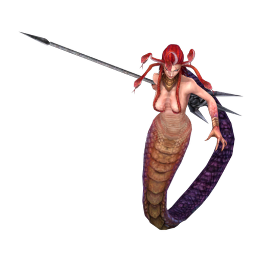

# Medusa

Medusa is the third boss of the [[Level 1|Cursed Wilds]] — a serpentine creature that glides at medium speed with substantial HP. Unlike earlier bosses, she has no elemental immunities, making her a test of raw DPS output.

| Stat | Value |
|---|---|
| Base HP | 1400 |
| Speed | Medium (52) |
| Armor | 22% Physical reduction |
| Resistances | None |
| Kill Reward | 85 gold |
| Appears | Wave 15 — Cursed Wilds |

---

## Traits

- Moderate armor — no major resistances.

---

## Strategy

Medusa is the first boss on Map 1 where speed matters as much as HP. At 1400 HP with medium movement, she can cover the path quickly if towers are placed sub-optimally. All damage types work — focus on maximizing DPS through upgrades and positioning rather than specific counters.

**Counters:** Any tower combination. [[Poison Tower]] DoT is particularly valuable at high HP targets. [[Frost Tower]] to slow medium-speed movement.

---

## Appears In

- [[Level 1]] — Wave 15
- Cursed Wilds campaign — Wave 15
