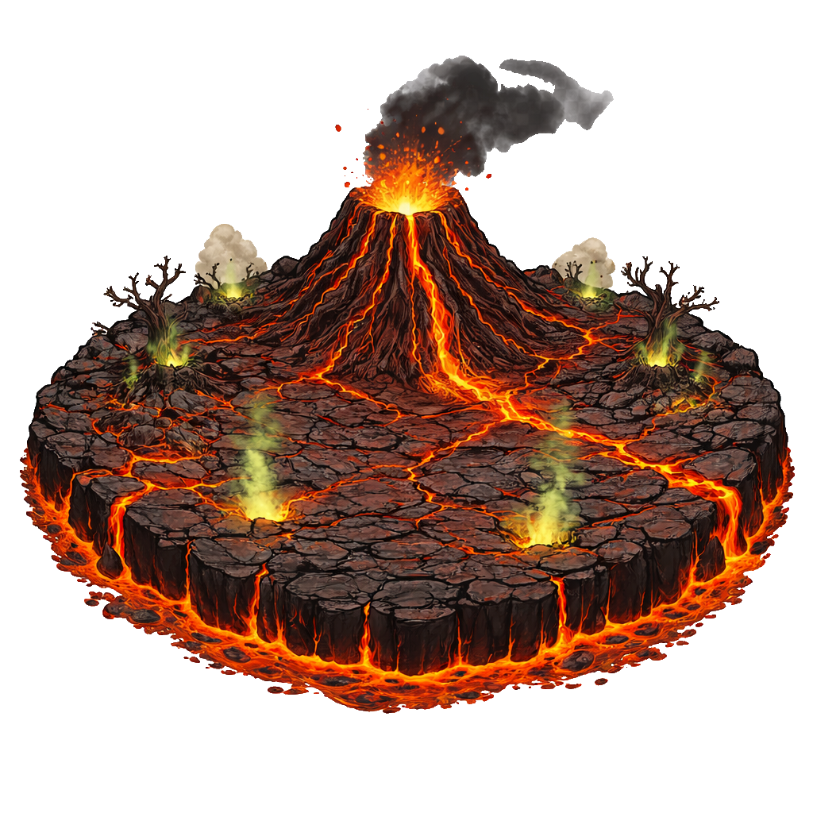

# Level 2 — Volcanic Inferno

## Overview

The Volcanic Inferno introduces flying threats and fire-immune bosses. Players must maintain Arrow or Lightning Tower coverage at all times or Imps will fly directly to the exit.

| Property | Value |
|---|---|
| World | Volcanic Inferno |
| Waves | 25 |
| Final Boss | [[Demon]] |
| Difficulty | Intermediate |
| Unlocks | Endless Mode (Volcanic Inferno) |

---

## Introduced Mechanics

- Flying enemies ([[Imp]]) — only Arrow Tower and Lightning Tower can target
- Fire immunity (Lav Golem, Demon bosses) — fire upgrade paths blocked
- Regeneration ([[Vampire]] boss) — requires Poison Tower to counter
- Heavy armor + multi-resist final boss (Demon)

---

## Recommended Towers

| Tower | Priority | Reason |
|---|---|---|
| [[Arrow Tower]] | Essential | Anti-air for [[Imp]] swarms |
| [[Lightning Tower]] | High | Chains to flying Imps; anti-armor |
| [[Frost Tower]] | High | Bonus damage vs fire-immune bosses; slow |
| [[Poison Tower]] | High | Required for [[Vampire]] boss; strong DoT |
| [[Fire Tower]] | Medium | Splash for ground groups |

---

## Enemy Composition

| Wave Range | Enemies |
|---|---|
| 1–3 | [[Goblin]] |
| 4–5 | [[Goblin]], [[Troll]] |
| 5 | Boss — [[Lav Golem]] |
| 6–9 | [[Goblin]], [[Troll]], [[Imp]] |
| 10 | Boss — [[Rat King]] |
| 11–14 | [[Goblin]], [[Troll]], [[Imp]] |
| 15 | Boss — [[Vampire]] |
| 16–19 | [[Goblin]], [[Troll]], [[Imp]] |
| 20 | Boss — [[Lizardman]] |
| 21–24 | Heavy mix: Troll, Imp |
| 25 | [[Demon]] |

---

## Boss Summary

| Wave | Boss | HP | Counter |
|---|---|---|---|
| 5 | [[Lav Golem]] | 950 | Frost (ice bonus), Lightning |
| 10 | [[Rat King]] | 2100 | Lightning, Arrow, Fire Tower |
| 15 | [[Vampire]] | 3000 | Poison (mandatory) |
| 20 | [[Lizardman]] | 3300 | Lightning, Poison |
| 25 | [[Demon]] | 4600 | Frost, Poison, Arrow |

---

## Difficulty Notes

- Normal: Anti-air coverage from wave 6 is non-negotiable
- Hard: Imp density in late waves can overwhelm a single Arrow Tower — build two
