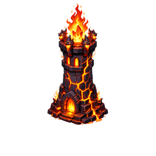

# Fire Tower

## Overview

The Fire Tower launches explosive shells that deal area-of-effect [[Fire]] damage on impact, leaving burning ground that applies a Burn DoT to enemies passing through. It is the primary swarm-clearing tower and the hardest counter to ice-resistant enemies.

| Stat | Value |
|---|---|
| Damage Type | [[Fire]] |
| Target | Area (Splash) |
| Range | Medium |
| Fire Rate | Low |
| Special | Ground fire · Burn DoT |

---

## Role

**Area Denial / Swarm Clearer.** The Fire Tower punishes tightly grouped enemies with its explosive splash. Its Burn DoT adds sustained pressure after each shot, and [[Fire]] damage bypasses cold resistances that neuter [[Frost Tower]].

---

## Strengths

- Highest area damage output per shot
- Burn DoT deals continued damage after impact
- [[Fire]] damage is effective against ice-resistant and undead enemies
- Excellent against groups of light enemies ([[Goblin]], [[Troll]])
- Path B: Siege Mortar adds an 8% max-HP armor-break hit — strong vs high-armor targets

---

## Weaknesses

- Low fire rate struggles against single fast targets
- Splash has limited value vs spread-out or flying enemies
- Fire-immune enemies ([[Twin Dragon]], [[Lav Golem]], [[Demon]]) take no damage
- Shorter range than [[Arrow Tower]]

---

## Synergies

| Tower | Reason |
|---|---|
| [[Arrow Tower]] | Arrow covers flyers and priority targets Fire Tower can't reach efficiently |
| [[Frost Tower]] | Slowed enemies cluster tightly, maximising splash hits per shell |
| [[Poison Tower]] | Poison softens grouped enemies for Fire Tower's burst |

---

## Countered By

- Fire-immune enemies — [[Twin Dragon]], [[Lav Golem]], [[Demon]] take zero damage
- Spread-out waves — splash value drops when enemies are spaced
- Fast single targets — low fire rate misses frequently

---

## Recommended Usage

- Place at tight bends or chokepoints where enemies cluster naturally
- Pair with [[Frost Tower]] upstream to force clustering via slow
- Essential counter to ice-resistant enemy waves
- Avoid relying on Fire Tower alone against fire-immune boss waves — supplement with [[Lightning Tower]] or [[Arrow Tower]]
