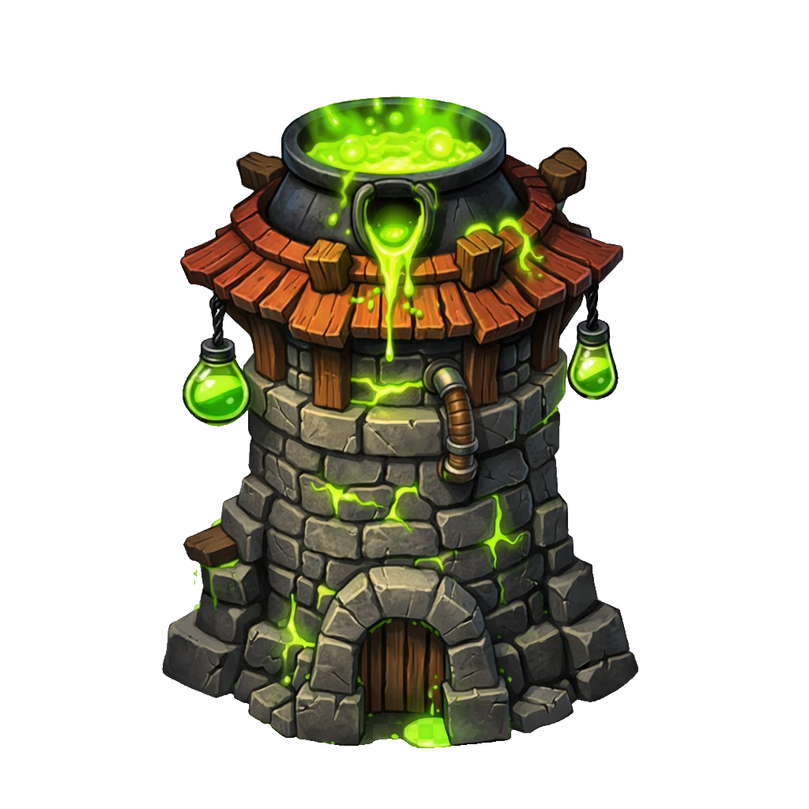

# Poison Tower

## Overview

The Poison Tower launches toxin projectiles that apply a damage-over-time (DoT) effect on hit. Its per-hit damage is low, but the stacking DoT makes it devastatingly efficient against high-health enemies and regenerating targets.

| Stat | Value |
|---|---|
| Damage Type | [[Poison]] |
| Target | Single |
| Range | Medium |
| Fire Rate | Medium |
| Special | Damage over time (DoT) |

---

## Role

**Sustained Damage / Anti-Regen.** Poison counters regenerating enemies by dealing continuous damage that outpaces healing. It is also one of the most gold-efficient towers for damaging tanky enemies over long path sections.

---

## Strengths

- DoT continues dealing damage after the projectile lands — no wasted shots on kills
- Hard counter to regenerating enemies whose healing is outpaced by the DoT
- Highly efficient on long paths — enemies are poisoned early and damaged throughout
- Pairs well with slow effects ([[Frost Tower]]) for maximum DoT exposure

---

## Weaknesses

- Poison-resistant enemies take significantly reduced DoT damage
- Low burst — cannot kill fast enemies before they exit range
- DoT does not stack from multiple Poison Towers (only the strongest active effect applies)
- Ineffective as a solo tower against boss phases with burst movement

---

## Synergies

| Tower | Reason |
|---|---|
| [[Frost Tower]] | Slow extends DoT duration on each enemy |
| [[Arrow Tower]] | Arrow provides burst finishing; Poison softens the target |
| [[Fire Tower]] | Poison weakens grouped enemies; Fire Tower's splash finishes them |

---

## Countered By

- Poison-resistant enemies — DoT greatly reduced
- Fast enemies that cross the range before DoT deals meaningful damage

---

## Recommended Usage

- Place near the path entrance so enemies are poisoned for the full route
- Mandatory pick on levels with regenerating enemies
- Avoid stacking multiple Poison Towers — DoT does not stack, investment is wasted
